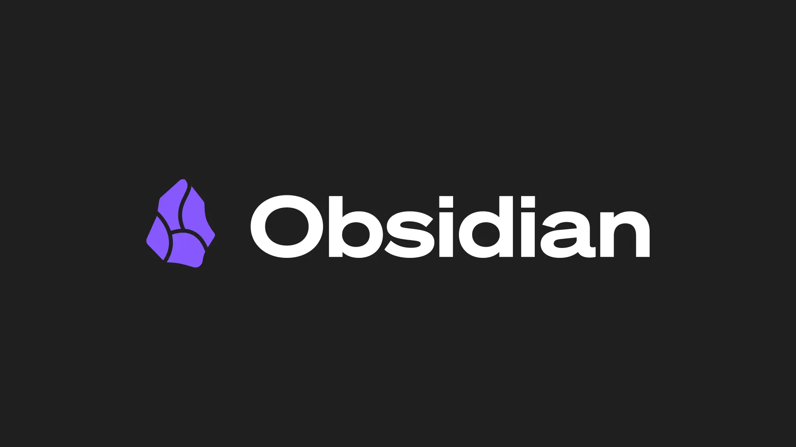

# Что такое `Obsidian` и `markdown`?

`Obsidian` - это не облачный сервис, а просто очень красивый и удобный интерфейс для работы с локальными текстовыми файлами формата `.md`

>[!note]
>Основные плюсы:
>1. Все файлы хранятся у Вас. Они не пропадут и Вас не смогут забанить. Но главное - никакой сети для написания заметок Вам не нужно.
>2. Они легкие по весу, т.к. любые фишки работают при помощи текстовых символов. В отличие от `Word`, например, мы передаём ненужные данные о размерах шрифта, самом шрифте, расположении каждого абзаца на странице и пр. Подробнее рассказано [в этом видео на youtube](https://youtu.be/7a-YGcVG4_0?si=fE2bQnz8mPMC9bOP)
>3. Очень легко налаживать контроль версий, особенно с таким средством как `GitHub` - легко отследить, какая строка изменилась, какой файл был перемещён и т.п.
>4. Есть множество уникальных фишек: возможность ссылаться на другие заметки, бесчисленное множество плагинов, самые разнообразные темы и многое другое.

Но не стоит забывать, что всё это лишь для удобства ведения заметок, не более того. Не нужны заметки? Не нужно хранить информацию? Тогда закройте эту вкладку

# Как пользоваться? Где изучить `markdown` и возможности приложения?

Когда Вы решитесь освоить `Obsidian`, советую пройти гайд от самих разработчиков. Цель гайда - научить Вас работать в `markdown` и показать некоторые уникальные фишки `Obsidian`. Если Вас интересует что-то другое касательно `Obsidian`, то у Вас всегда есть возможность посетить официальный сайт - [Home - Obsidian Help](https://obsidian.md/help/).

Для получения гайда Вам потребуется либо в меню `Manage Vaults` найти `Sandbox Vault`, либо если там её нет, то открыть любую папку как `Vault`, а затем снизу в панели настроек найти знак вопроса, кликнув на который, у Вас откроется меню пунктом `Sandbox Vault`.

>[!tip]
>Как оказалось, эти инструкции - не полный разбор возможностей `Obsidian`. Совершенно случайно мне попался разбор куда лучше, так сказать, уже для взрослых, но предназначенный изначально для обучения `gemini` работе с приложением. Этот разбор я скачал с сайта плагина [Gemini Scribe](https://github.com/allenhutchison/obsidian-gemini/). В папке [bundled-skills](https://github.com/allenhutchison/obsidian-gemini/blob/master/prompts/bundled-skills) есть несколько заметок, но для человека полезна только эта четвёрка:
>
> | Тема                       | Ссылка                  |
> | -------------------------- | ----------------------- |
> | Obsidian Flavored Markdown | [obsidian-markdown](guides_for_ai/obsidian-markdown.md)   |
> | Obsidian Properties        | [obsidian-properties](guides_for_ai/obsidian-properties.md) |
> | JSON Canvas                | [json-canvas](guides_for_ai/json-canvas.md)         |
> | Obsidian Bases             | [obsidian-bases](guides_for_ai/obsidian-bases.md)      |
>
> Для изучения `Obsidian` достаточно прочитать 1-ый файл, [obsidian-markdown](guides_for_ai/obsidian-markdown.md). Остальное - уже на любителя.

Перед тем, как начать составлять заметки, советую ознакомиться с моей [заметкой для "инициализации" `Vault`](Initial.md).

# Что нужно, чтобы начать?

Чтобы уже сейчас начать работать с `Obsidian`, Вам достаточно:
- изучить `SandBox Vault` и/или [`obsidian-markdown`](guides_for_ai/obsidian-markdown.md)
- прочитать [мои must-have для начальных настроек приложения](guides_for_ai/initial.md#must-have)

# Более глубокое изучение

## Личные советы

### Топики

Чтобы Ваши заметки ~~удобно~~ можно было читать, используйте топики. Благодаря ним Вы, например, можете прямо сейчас найти в правок верхнем углу иконку списка, кликнуть на неё и увидеть выжимку того, что есть в этой заметке. Так что топики - это прям must-have. Такое же меню, как и тут, на гитхабе, Вы всегда можете открыть и в `Obsidian` (находится в правом верхнем углу в виде значка из трёх полосок)

### Callout-ы

Помимо топиков в Вашей власти так называемые callout-ы. О них было написано в `Sandbox Vault`, однако там есть опечатки (возможно просто устаревшая версия). Актуальную информацию о них можете посмотреть, перейдя по ссылкам ниже.

| Платформа | Ссылка                                            |
| :-------- | :------------------------------------------------ |
| GitHub    | [Callouts_for_GitHub](Callouts_for_GitHub.md)     |
| Obsidian  | [Callouts_for_Obsidian](Callouts_for_Obsidian.md) |

Важно отметить, что callout-ы для `GitHub` работают в `Obsidian`, но в обратную сторону это не работает. Так что будьте внимательны. И ещё важное НО: `GitHub`-callout-ы не поддерживают заголовки, так что вместо `>[!tip] Мегасовет!` придётся писать просто `>[!tip]`

Чтобы увидеть, как выглядят обсидиановские callout-ы, сохраните эту заметку в свою `Vault`. Крайне рекомендую их использовать пореже, чтобы не привыкать. GitHub их обеспечить не может. Мне они понадобились только для публикации сайта на [Quartz](#Публикация)

### Расположение файлов в дереве

Слева в дереве сначала располагаются папки, а затем файлы. Между собой они сортируются в порядке кодов из `Unicode`.

> [!tip] Как упорядочить файлы и папки по-своему?
Если Вы хотите отправить какую-то папку на самый верх, то можете воспользоваться следующей упорядочённой цепью:
>
`!файл -> #файл -> @файл -> _файл -> 01_файл -> A_файл`
>
Также стоит отметить, что всякая английская буква младше всякой русской и что никто не мешает Вам задать порядок следующим образом:
>
>`01_файл -> 02_файл -> ...`

>[!tip] Сохранение смысла заметок
Также многие из `youtube` рекомендуют в каждой папке хранить главную заметку, которая опишет, что в текущей папке находится. Очень полезно, когда заметок становится так много, что не сыскать ни конца, ни начала. Аналог такого на гитхабе - `README`-файлы.

### Hot Keys

Горячие клавиши (англ. **Hot Keys**) - это отличный способ ускорить Вашу работу с ноутбуком в разы. Не игнорируйте их. Да, и без них можно обойтись, но ведь и без `Obsidian` Вы могли бы обойтись)

>[!important]
>Горячих клавиш так много, что люди зачастую опускают руки сразу при начале изучения этих связок. Оно и понятно: этих горячих клавиш существует сотни, если не тысячи. Однако есть важное НО: из них Вам понадобятся максимум 20. Об этом Вам никто не скажет)

^357cce

Про них я написал в заметке [HotKeys](HotKeys.md). Там же есть раздел [для `Obsidian`](HotKeys.md#Obsidian)

>[!tip]
>Главной связкой клавиш для `Obsidian` служит сочетание `Ctrl + E`, позволяющее переключать режим чтения на редактирование и наоборот
## Синхронизация

Чтобы синхронизировать свою `Vault` между устройствами или просто хранить где-то помимо Вашего ПК, есть несколько вариантов:
1. Самый простой - через [Obsidian Sync](https://obsidian.md/help/sync) (4$ в месяц)
2. Через гугл, яндекс или другой диск (цена только за Ваш диск). Крайне рекомендую в таком случае прибегнуть к следующей архитектуре, чтобы не синхронизировать папку `.obsidian` (если не знаете, почему её и прочие скрытые папки не стоит синхронизировать, спросите у ИИ):
	- Папка Storage
		- Папка `.obsidian`
		- Папка для синхронизации с Вашим каким-то диском
3. При помощи GitHub через создания `private`-репозитория (бесплатно). Для синхронизации между устройствами (в том числе мобильными) советую прочитать этот гайд (в нём будет также рассказано, как запускать коммиты автоматически и периодически): [Obsidian+Github вместо Notion: синхронизация, бекап и версионность (3-в-1) / Хабр](https://habr.com/ru/articles/843288/?ysclid=mrj9ut2748789300662)

Забавно, что чем дешевле вариант, тем он проще.

## Публикация

`Obsidian` ещё и хорош тем, что любую Вашу `Vault` очень просто превратить в сайт, т.е. опубликовать. Есть два способа:
- Через сайт через [Obsidian Publish](https://obsidian.md/help/publish) (8$ в месяц)
- Через [Quartz 5](https://quartz.jzhao.xyz/) (бесплатно, но весьма сложно)

>Сами инструкции - это и есть `Vault`, опубликованные на сайте. Перейдя на сайты, Вы увидите, как будет выглядеть Ваш `Vault` после публикации